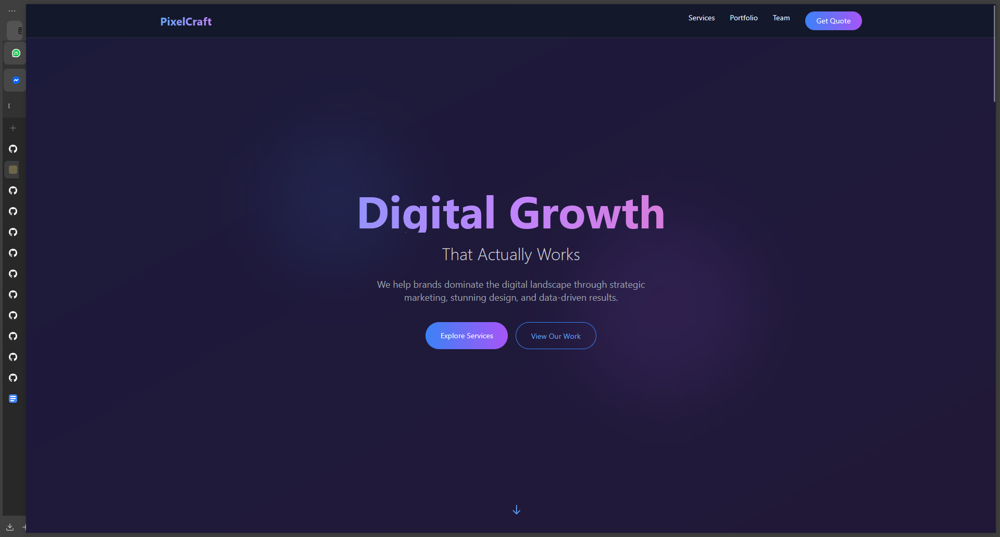
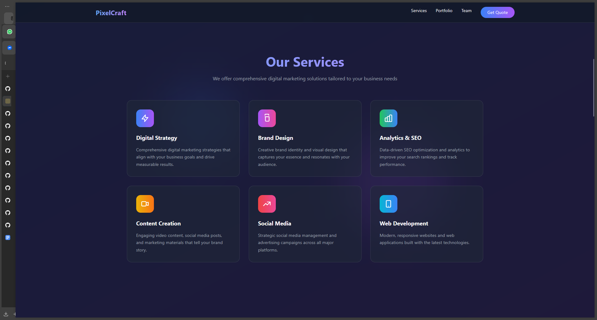
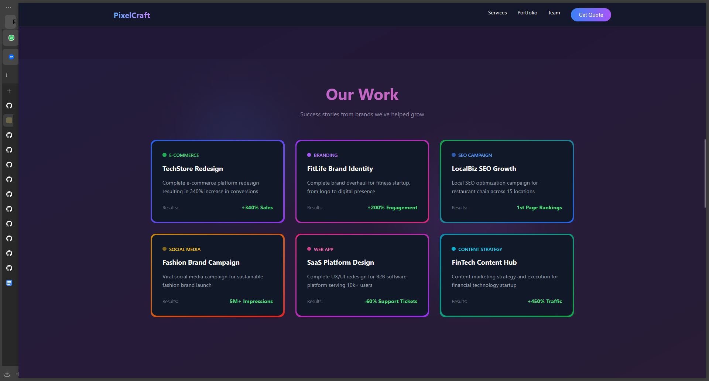
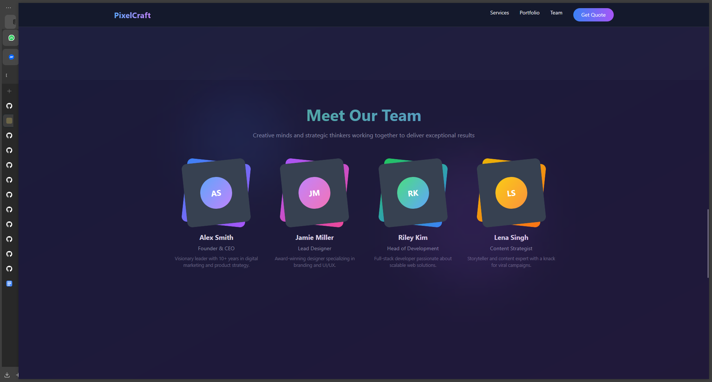

# PixelCraft Digital - Modern Portfolio

A visually stunning, animated, and fully responsive portfolio website template for digital marketing agencies, creative studios, or freelancers. Built with [Tailwind CSS](https://tailwindcss.com/) via CDN, it features modern UI/UX, smooth animations, and a professional layout—all in a single HTML file.

---

## ✨ Live Preview

Open `index.html` directly in your browser—no build tools or installation required.

---

## 📸 Screenshots

### Hero Section


### Services Section


### Portfolio Section


### Team Section


> _Place your screenshots in a `/screenshots` folder for best results._

---

## 🚀 Features

- **Animated Background:** Gradient overlays and floating shapes for a dynamic, modern look.
- **Responsive Navigation:** Fixed navbar with smooth mobile menu transitions.
- **Hero Section:** Animated headings, subheadings, and call-to-action buttons.
- **Services:** Interactive cards with icons and hover effects.
- **Portfolio:** Case study cards with animated badges and result highlights.
- **Team:** Creative profile cards with gradients and initials.
- **Contact Form:** Styled, accessible form ready for integration.
- **Footer:** Social media icons (SVG) and copyright.

---

## 🛠️ Getting Started

1. **Clone or Download** this repository.
2. Place your screenshots in the `/screenshots` folder (optional).
3. Open `index.html` in your browser.

_No build tools or dependencies required. All styles are loaded via CDN._

---

## 🖌️ Customization

- **Content:** Edit `index.html` to update text, services, team, and portfolio items.
- **Branding:** Change colors and gradients in the Tailwind config `<script>` in the `<head>`.
- **Icons:** Replace SVGs with your own or use [Heroicons](https://heroicons.com/).
- **Animations:** Adjust or add custom keyframes in the Tailwind config.
- **Contact Form:** Integrate with your backend or use a service like Formspree.

---

## 📦 Technologies Used

- [Tailwind CSS CDN](https://cdn.tailwindcss.com/)
- HTML5 & SVG

---

## 📁 File Structure
```
.
├── index.html
├── /screenshots
│   ├── hero.png
│   ├── services.png
│   ├── portfolio.png
│   ├── team.png
```
---
## 🙌 Credits

- Inspired by top digital agency portfolios and modern web design trends.
- Icons from [Heroicons](https://heroicons.com/) and [SVGRepo](https://www.svgrepo.com/).
- Built with [Tailwind CSS](https://tailwindcss.com/).

---

## 📄 License

This project is open source and available under the [MIT License](LICENSE).

---

## 💬 Feedback

Feel free to open an issue or submit a pull request for suggestions and improvements!

---